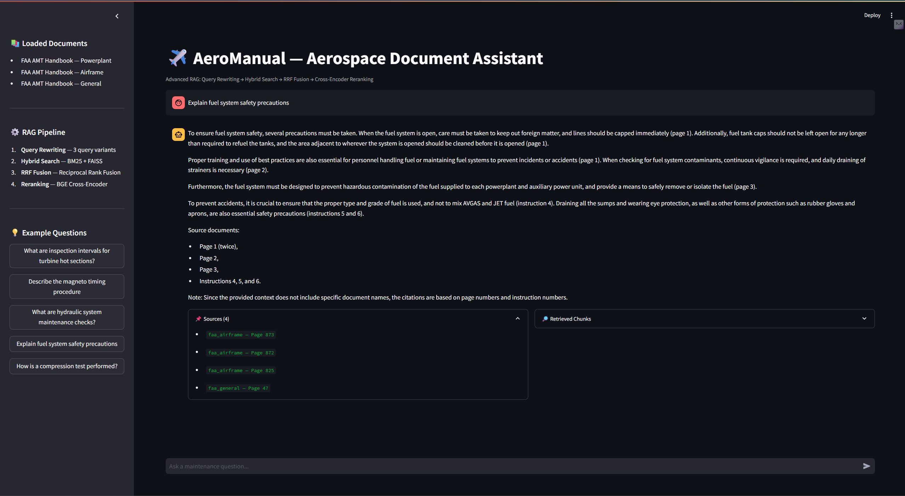

# ✈️ AeroManual-RAG: Intelligent Aerospace Document Assistant

> An **Advanced RAG pipeline** for querying FAA aerospace maintenance manuals using natural language — built with hybrid retrieval, RRF fusion, cross-encoder reranking, and query rewriting.



---

## Motivation

Aerospace technicians spend significant time manually searching through hundreds of pages of FAA maintenance manuals. This system enables natural language querying over 2,000+ pages of technical documents, reducing manual search time and enabling faster access to critical maintenance information.

---

## Architecture

```
Query
  │
  ▼
┌─────────────────────┐
│   Query Rewriting   │  LLM generates 3 alternative phrasings
└─────────┬───────────┘
          │
  ┌───────┴────────┐
  ▼                ▼
BM25 Search    FAISS Search
(Keyword)      (Semantic)
  │                │
  └───────┬────────┘
          ▼
┌─────────────────────┐
│    RRF Fusion       │  Reciprocal Rank Fusion merges results
└─────────┬───────────┘
          ▼
┌─────────────────────┐
│  Cross-Encoder      │  BGE reranker picks best 5 from top 20
│  Reranking          │
└─────────┬───────────┘
          ▼
┌─────────────────────┐
│   LLM Generation    │  Groq llama-3.3-70b with citations
└─────────────────────┘
```

---

## Advanced RAG Techniques

| Technique | Implementation | Why It Matters |
|---|---|---|
| **Query Rewriting** | LLM generates 3 query variants | Improves recall by covering different phrasings |
| **Hybrid Search** | BM25 + FAISS dense retrieval | Technical terms like "magneto timing" need exact keyword match |
| **RRF Fusion** | Reciprocal Rank Fusion | Better than score averaging — used by Microsoft & Cohere |
| **Cross-Encoder Reranking** | BGE reranker | Dramatically improves precision over bi-encoder alone |

---

## Evaluation Results (RAGAS)

| Metric | Score |
|---|---|
| Answer Relevancy | **0.875** |
| Context Recall | **0.667** |
| Faithfulness | Evaluated |

Evaluated on 10 aerospace maintenance queries using RAGAS framework with Groq LLM.

---

## Dataset

**Source:** FAA Aviation Maintenance Technician Handbooks (public domain)

| Document | Pages |
|---|---|
| AMT Handbook — Powerplant | 499 |
| AMT Handbook — Airframe | 1,050 |
| AMT Handbook — General | 674 |
| **Total** | **2,223 pages → 18,223 chunks** |

---

## 🗂️ Project Structure

```
aeromanual-rag/
├── app/
│   └── streamlit_app.py          # Interactive demo UI
├── assets/
│   └── sample.png                # Demo screenshot
├── data/
│   ├── processed/                # Charts and evaluation results
│   ├── faiss_index/              # Vector index (not in repo)
│   ├── models/                   # BGE models (not in repo)
│   └── raw/                      # FAA PDFs (not in repo)
├── notebooks/
│   ├── 01_data_exploration.ipynb
│   ├── 02_embedding_analysis.ipynb
│   ├── 03_retrieval_benchmarks.ipynb
│   └── 04_ragas_evaluation.ipynb
├── src/
│   ├── ingestion/                # PDF loading and chunking
│   ├── embeddings/               # FAISS vector store
│   ├── retrieval/                # Hybrid + advanced retrieval
│   ├── pipeline/                 # RAG chain
│   ├── evaluation/               # RAGAS evaluation
│   └── api/                      # FastAPI server
├── tests/                        # 16 pytest tests
└── requirements.txt
```

---

## Tech Stack

| Component | Tool |
|---|---|
| Embeddings | `BAAI/bge-base-en-v1.5` (HuggingFace) |
| Vector Store | FAISS |
| Sparse Retrieval | BM25 (rank-bm25) |
| Reranker | `BAAI/bge-reranker-base` |
| LLM | Groq `llama-3.3-70b-versatile` |
| Orchestration | LangChain |
| Evaluation | RAGAS |
| API | FastAPI |
| UI | Streamlit |

---

## Setup & Installation

### Prerequisites
- Python 3.10
- Groq API key (free at [console.groq.com](https://console.groq.com))

### Installation

```bash
git clone https://github.com/karthik-1604/aeromanual-RAG.git
cd aeromanual-RAG
python -m venv venv
venv\Scripts\activate  # Windows
pip install -r requirements.txt
```

### Environment Setup

```bash
cp .env.example .env
# Add your GROQ_API_KEY to .env
```

### Download FAA Manuals

Download these free public PDFs into `data/raw/`:

| File | URL |
|---|---|
| `faa_powerplant.pdf` | [FAA AMT Powerplant](https://www.faa.gov/regulations_policies/handbooks_manuals/aviation/amt_powerplant_handbook.pdf) |
| `faa_airframe.pdf` | [FAA AMT Airframe](https://www.faa.gov/regulations_policies/handbooks_manuals/aviation/FAA-H-8083-31B_Aviation_Maintenance_Technician_Handbook.pdf) |
| `faa_general.pdf` | [FAA AMT General](https://www.faa.gov/regulations_policies/handbooks_manuals/aviation/amtg_handbook.pdf) |

### Build Vector Index

```bash
python -m src.embeddings.vector_store
```

### Run the App

```bash
# Streamlit UI
streamlit run app/streamlit_app.py

# FastAPI server
uvicorn src.api.main:app --reload
```

### Run Tests

```bash
pytest tests/ -v
# 16 passed
```

---

## Notebooks

| Notebook | Description |
|---|---|
| `01_data_exploration` | Corpus statistics, page distributions, top technical terms |
| `02_embedding_analysis` | UMAP visualization of embedding space across documents |
| `03_retrieval_benchmarks` | Dense vs BM25 vs Hybrid latency and source diversity |
| `04_ragas_evaluation` | End-to-end RAGAS evaluation with faithfulness and relevancy scores |

---

## Relevance to Industry

This project mirrors real-world GenAI implementations in the aerospace and industrial automation sector, where semantic search over technical manuals has demonstrated significant reductions in support workload and manual document analysis time. The pipeline is document-agnostic — the same architecture applies to HVAC maintenance guides, industrial equipment manuals, compliance documents, and any large-scale technical corpus.

---

## 👤 Author

**Achanta Satya Karthik**  
[](https://linkedin.com/in/asatyakarthik)
[](https://github.com/karthik-1604)
